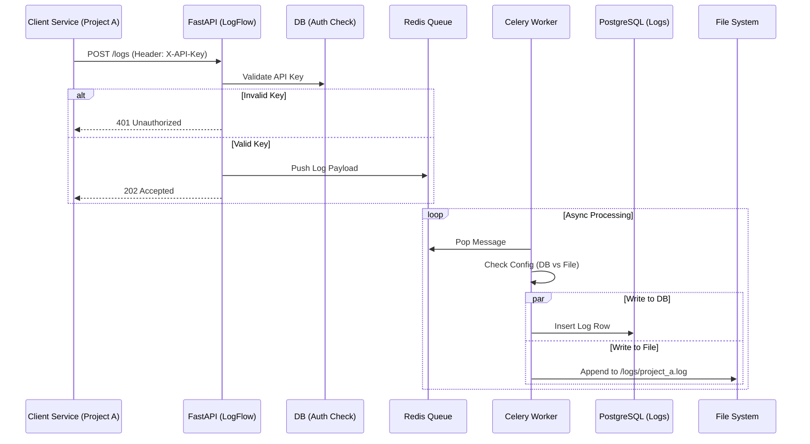
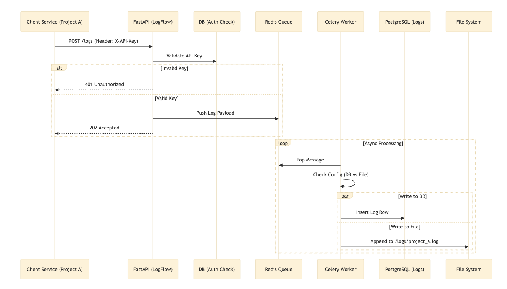

## Product Requirement Document (PRD)

### 1\. Product Name

**LogFlow** (Internal)

### 2\. Overview

A lightweight, centralized logging ingestion service. It acts as a buffer between high-throughput services and slower storage layers. It validates incoming logs via API Keys and persists them to either a PostgreSQL database, a file system, or both, depending on configuration.

### 3\. Functional Requirements

  * **Ingestion:** REST API (POST `/logs`) accepting JSON logs.
  * **Auth:** Authentication via `X-API-Key` header. Each client project has a unique key.
  * **Async Processing:** Logs are pushed to Redis immediately; Celery workers handle writing to storage.
  * **Storage Strategies:**
      * **Database:** Store structured logs in PostgreSQL for querying.
      * **File:** Append logs to daily rotating files (e.g., `/logs/{project_id}/2023-10-27.log`) for archival/backup.
  * **Volume:** Capable of handling \~20 logs/second with bursts.

### 4\. Data Model

  * **Project:** `id` (PK), `name`, `api_key`, `is_active`
  * **Log:** `id`, `project_id` (FK), `level` (INFO, WARN, ERROR), `message`, `metadata` (JSON), `timestamp`

-----

## Part 2: System Architecture

### Architecture Diagram (Mermaid)






-----

## Part 3: Project Structure & Code

This structure separates the **API** (Producer) from the **Worker** (Consumer) while sharing the **Database Models** and **Settings**.

```text
logflow/
├── app/
│   ├── __init__.py
│   ├── main.py            # FastAPI Entrypoint
│   ├── dependencies.py    # Auth logic (API Key check)
│   ├── schemas.py         # Pydantic models (Input validation)
│   ├── config.py          # Env variables
│   └── database.py        # DB connection factory
├── worker/
│   ├── __init__.py
│   ├── celery_app.py      # Celery Setup
│   ├── tasks.py           # Task logic
│   └── backends.py        # Strategy pattern for DB vs File writing
├── models/
│   ├── __init__.py
│   └── orm.py             # SQLAlchemy models (Project, Log)
├── init_db.py # Script to bootstrap DB and create initial API Key 
├── .env
├── docker-compose.yml
└── requirements.txt
```
